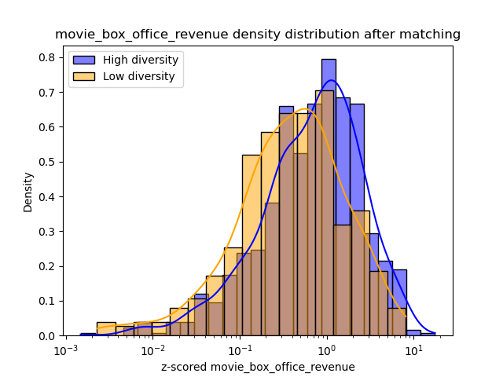
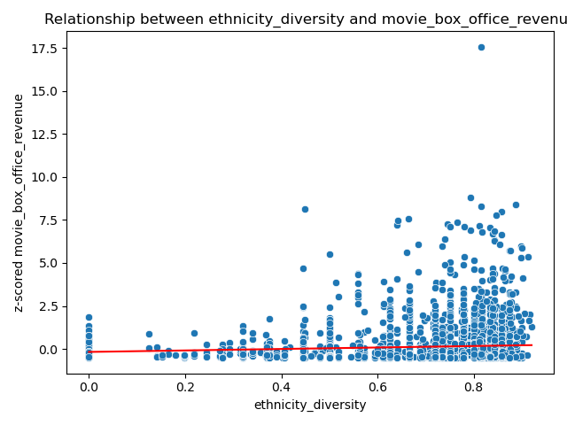

The topic of diversity is gaining increasing attention nowadays. Many studies, like [this McKinsey & Company report](https://www.mckinsey.com/capabilities/people-and-organizational-performance/our-insights/why-diversity-matters), affirms that diversity is not just a buzzword but a pivotal aspect of business success. We would like to assess whether this phenomenon is also applicable to the movie industry.
Consider the groundbreaking success of movies like Black Panther and Barbie. These films not only shattered box office records but also marked a significant cultural moment by celebrating diversity in ethnicity and gender, respectively. Their success prompts a deeper reflexion: Is there a tangible link between a film's performance, i.e its box office earnings and public ratings, and its cast's diversity ?

## Introduction
Join us on this cinematic journey as we unravel the data story behind diversity in films. We will dissect this relationship by analyzing a variety of films across genres, from blockbuster hits to indie gems, our research will shed light on whether films with diverse casts resonate more profoundly with audiences and critics alike. 

By navigating in the data we will uncover the patterns, understand the impacts, and discover whether the movies we love are a reflection of the diverse world we live in. Are diverse casts just a trend, or are they a key ingredient to a film's success ? Let the data respond !

## Let's do a first naive analysis

#### What's really Diversity ?

First, to best perform analysis we will need to define how we will measure diversity. We already said that we will focus on the ethnicity and the gender of the films actors but we need a quantitative tool to treat the data well. We chose to use the Simpson Diversity Index, which is calculated by assessing the likelihood that two randomly chosen individuals from a sample will not belong to the same species. A key strength of this index is that it considers not just the variety of species present but also the relative abundance of each species. 

This means that if we compare two scenarios:

- Movie 1: 20% representation for each of 5 ethnicities.
- Movie 2: 99% representation of one ethnicity, with 100 different ethnicities comprising the remaining 1%.

We find that **D1 = 0.8** is significantly greater than **D2 = 0.02**. This result is coherent as Movie 1 appears to have a more diverse cast, even though Movie 2 includes a greater number of ethnicities.

We utilized this index to analyze the films in our dataset, leading to the creation of the pie chart displayed below:

<iframe src="assets/distrib_diversity_2.html" width="750px" height="500px" frameborder="0" position="relative">Genre plot</iframe>

We observe that a high majority of the films have a very high gender diversity. For the ethnic diversity, the distribution is more nuanced but we can say that the majority of the films have a good ethnic diversity.

#### Diversity as a sign of progress in the film industry ?

In today's world, diversity and inclusion are key values, showing our hope for a fairer and more inclusive society. This is a big change from just 20 years ago when these issues were often ignored. As society has changed, we're looking at different areas, like the movie industry, to see if they've kept up with these changes.

<iframe src="assets/diversity_over_time.html" width="750px" height="500px" frameborder="0" position="relative">Genre plot</iframe>

Upon examining the data, we notice a particular trend regarding gender diversity. The curve, representing the evolution of gender representation, unfortunately, does not indicate significant progress. This stagnation suggests that while conversations around gender equality have become more mainstream, the translation of these discussions into tangible change within the film industry has been limited.
On the other hand, a more hopeful narrative emerges when we consider ethnic diversity. Here, the graph depicts an upward trajectory, indicating a gradual but apparent increase in the representation of various ethnicities on screen. This trend reflects a growing acknowledgment within the industry of the importance of racial and cultural representation, and while there's still much ground to cover, it suggests a positive direction towards inclusivity.

#### Naive analysis of the relationship between Ethnic Diversity and Box Office Revenue 

Before starting the analysis we want to emphasize the diversity of films in our study. We can see on the following plot that we have indie films having less than $20M in box office revenue as well as big films. This ensures our insights reflect the entire film industry, not just a single segment.

<iframe src="assets/distrib_boxoffice.html" width="750px" height="500px" frameborder="0" position="relative">Genre plot</iframe>

We've been looking into whether there's a link between the variety of ethnic backgrounds in a movie's cast and how much money the movie makes. To do this, we first checked out the movie's box office receipts, which tell us how well it did financially.
We did some math and found a Pearson correlation of about 0.217 between the ethnic mix of a movie's cast and the money it made at the box office. This positive link is important because it's strong enough (the p-value is less than 0.05) to suggest that movies tend to earn more when they have a more ethnically diverse cast.

To dig deeper into how the ethnic mix of the cast affects a movie's earnings, we realized a regression analysis. This helped us see just how much of an impact diversity has on the money movies make and get a clearer picture of how these two things are connected. You can see the results on the following regression graph : 

<iframe src="assets/diversity_ethnicity_corr_boxoffice.html" width="750px" height="500px" frameborder="0" position="relative">Genre plot</iframe>

Our findings do show a real link between a film’s cast ethnic diversity and its box office success. But we also found that while ethnic diversity is part of the story, it doesn't tell us everything about why some movies make more money than others. There are likely other factors at play too.

#### Naive analysis of the relationship between Gender Diversity and Box Office Revenue 

We also took a look at the gender diversity influence. After the stastics test we found a very low Pearson correlation which tell us there's basically no straight-line relationship between the two. Having a more balanced mix of genders in the cast doesn't seem to have a clear link with the movie's financial success.
As for the ethnic diversity analysis we did a regression analysis to confirm what we found resulting in the following graph :  

<iframe src="assets/gender_corr_boxoffice.html" width="750px" height="500px" frameborder="0" position="relative">Genre plot</iframe>

After looking at the scatter plot, it's clear that the numbers back up what we found in our analysis: the mix of genders in a movie's cast doesn't really have a noticeable link with how much money the movie makes. So, while gender diversity is important for many reasons, it doesn't seem to have a big impact on a movie's box office revenue based on this data.

#### What about Average Ratings ?

The other metric we chose to evaluate performance is the average rating of a movie. The following chart shows the distribution of the different average ratings accros the films :

<iframe src="assets/distrib_rating.html" width="750px" height="500px" frameborder="0" position="relative">Genre plot</iframe>

As we did for the box office revenue we will conduct some first analysis to try to see if there is a correlation between ethnic and gender diversity and the film’s average rating.
We resumed our results in the following table :

| | Pearson correlation | Linear regression |
|-------|--------------------------|---------|
| Ethnic diversity of the cast and the movie's box office revenue | Positive and significant | Positive and significant |
| Ethnic diversity of the cast and the movie's rating | None | None |
| Gender diversity of the cast and the movie's box office revenue | None | None |
| Gender diversity of the cast and the movie's rating | None | None |

In conclusion, based on our naive analysis, we can say that having a more diverse cast in terms of ethnicity tends to result in higher movie box office earnings. However, for other combinations, no definitive conclusions can be drawn.

## Global causal analysis

In this section, we're going to look closely at how movie performance is related to ethnic and gender diversity. Usually, a naive analysis might miss other factors that can change the results, like the number of languages a movie is translated into, its release year, and genre. To avoid this, we'll use a method called propensity score matching. This helps us compare movies with diverse casts (our treatment group) to those with less diversity (our control group) in a fair way. We'll make sure other factors are balanced between these groups. We'll then examine how movie ratings and box office earnings are connected to diversity, breaking down our findings for each type of diversity we study.

#### Propensity score matching

In the graph below, we notice that the number of languages in movies is fairly even, but the release years are quite uneven between the control and treatment groups. To fix this, we use propensity score matching to create a more balanced dataset considering these factors.

<iframe src="assets/before_after_matching.html" width="1000px" height="500px" frameborder="0" position="relative">Genre plot</iframe>

When you click the "After" button, you'll see the results post-matching. Now, the release years are more evenly spread between the control and treatment groups. This means these factors won't really affect our study of performance and diversity.

#### Impact of Ethnic Diversity on Box Office

 

From the distribution above and statistical tests, we see that the relationship between a movie's box office performance and the fact that it received treatment (having a diverse cast), is a positive correlation. It indicates that having a diverse cast in terms of ethnicity brings a better performance in terms of box office.

## Causal Analysis accross time periods

<iframe src="assets/ethnicity_boxoffice_timeperiods.html" width="750px" height="500px" frameborder="0" position="relative">Genre plot</iframe>

<iframe src="assets/gender_boxoffice_timeperiods.html" width="750px" height="500px" frameborder="0" position="relative">Genre plot</iframe>
