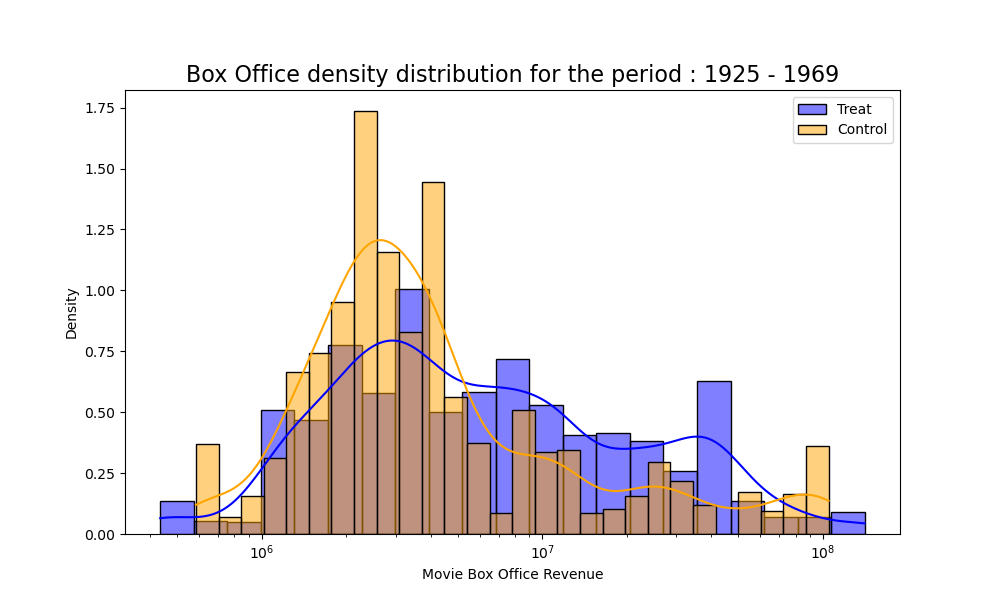

The topic of diversity is gaining increasing attention nowadays. Many studies, like [this McKinsey & Company report](https://www.mckinsey.com/capabilities/people-and-organizational-performance/our-insights/why-diversity-matters), affirm that diversity is not just a buzzword but a pivotal aspect of business success. We would like to assess whether this phenomenon is also applicable to the movie industry.  After reading this report, a prominent producer at 20th Century, one of Hollywood's most renowned film studios, began to seriously consider that diversity in its castings might be the key to improving performance of its future productions. He decided to contact us to know if we can prove the point that Mckinsey & Company is making in its report. 

## Introduction
Lights, Camera, Action! Join us on this journey as we unravel the data story behind the impact diversity in films' success. We will dissect this relationship by analyzing a variety of films across genres, from blockbuster hits to indie gems, our research will shed light on whether films with diverse casts resonate more profoundly with audiences and critics alike. 

By navigating in the data we will uncover the patterns, understand the impacts, and discover whether the movies we love are a reflection of the diverse world we live in. Are diverse casts just a trend, or are they a key ingredient to a film's success ? Let the data respond !

#### Wait... what really is Diversity ?

First, to best perform analysis we will need to define how we will measure diversity. We already said that we will focus on the ethnicity and the gender of the films actors but we need a quantitative tool to treat the data well. We chose to use the [Simpson Diversity Index](https://stats.stackexchange.com/a/62744), which is calculated by assessing the likelihood that two randomly chosen individuals from a sample will not belong to the same species. A key strength of this index is that it considers not just the variety of species present but also the relative abundance of each species. 

This means that if we compare two scenarios:

- Movie 1: 20% representation for each of 5 ethnicities.
- Movie 2: 99% representation of one ethnicity, with 100 different ethnicities comprising the remaining 1%.

We find that **D1 = 0.8** is significantly greater than **D2 = 0.02**. This result is coherent as Movie 1 appears to have a more diverse cast, even though Movie 2 includes a greater number of ethnicities.

  
 Mathematics for nerds 🤓

  
  The Simpson Diversity Index is calculated as follows :

$D = 1 - \sum_{k=1}^{K} \left(\frac{n_k}{N}\right)^2$

Where : 
- **N** represents the total number of units in the population
- **K** denotes the different types within it.
- For each type **k**, **$n_k$** is the number of units.
- The value of **D** varies between 0 and 1, with a lower value indicating less diversity in the population.

We used this index to analyze the films in our dataset, leading to the creation of the bar plots displayed below:

<iframe src="assets/distrib_diversity_3.html" width="800px" height="500px" frameborder="0" position="relative">Genre plot</iframe>

We observed for Ethnic Diversity that :
* A considerable number of local movies feature actors exclusively from the same country or ethnicity, which accounts for the noticeable instances of a 0 diversity score.
* This distribution is derived using the Simpson diversity index, which considers two actors diverse if they do not have the exact same label. Given the dataset's extreme imbalance in terms of ethnicities, it's expected that the distribution won't be smooth. However, it's noteworthy that the frequency appears lower at the extremes and higher around the 0.5 mark.

And for Gender Diversity :
* Many movies feature only male actors, which accounts for the noticeable instances of a 0 diversity score.
* The distribution is not symmetrical. While there are numerous movies with a predominance of male actors, the same is not true for female actors

#### Diversity as a sign of progress in the film industry ?

In today's world, diversity and inclusion are key values. This is a big change from just 20 years ago when these issues were often ignored. As society has changed, we looked at the movie industry, to see if they've kept up with these changes.

<iframe src="assets/diversity_over_time.html" width="800px" height="500px" frameborder="0" position="relative">Genre plot</iframe>

Upon examining the data, we noticed a particular trend regarding gender diversity. The curve, representing the evolution of gender representation, unfortunately, does not indicate significant progress. This stagnation suggests that while conversations around gender equality have become more mainstream, the translation of these discussions into tangible change within the film industry has been limited.
On the other hand, a more hopeful narrative emerged when we considered ethnic diversity. Here, the graph depicts an upward trajectory, indicating a gradual but apparent increase in the representation of various ethnicities on screen. This trend reflects a growing acknowledgment within the industry of the importance of racial and cultural representation, and while there's still much ground to cover, it suggests a positive direction towards inclusivity.

## Now let's be naive for a moment...

#### Naive analysis of the relationship between Ethnic Diversity and Box Office Revenue 

Before starting the analysis, we wanted to emphasize the diversity of films in our study. We can see on the following plot that we have indie films having less than $20M in box office revenue as well as big films. This ensures our insights reflect the entire film industry, not just a single segment.

<iframe src="assets/distrib_boxoffice.html" width="750px" height="500px" frameborder="0" position="relative">Genre plot</iframe>

We looked into whether there's a link between the variety of ethnic backgrounds in a movie's cast and how much money the movie makes. To do this, we first checked out the movie's box office receipts, which tell us how well it did financially.
We did some math and found a Pearson correlation of about 0.217 between the ethnic mix of a movie's cast and the money it made at the box office. This positive link is important because it's strong enough (the p-value is less than 0.05) to suggest that movies tend to earn more when they have a more ethnically diverse cast.

To dig deeper into how the ethnic mix of the cast affects a movie's earnings, we realized a regression analysis. This helped us see just how much of an impact diversity has on the money movies make and get a clearer picture of how these two things are connected. You can see the results on the following regression graph : 

<iframe src="assets/diversity_ethnicity_corr_boxoffice.html" width="750px" height="500px" frameborder="0" position="relative">Genre plot</iframe>

Our findings do show a real link between a film’s cast ethnic diversity and its box office success. But we also found that while ethnic diversity is part of the story, it doesn't tell us everything about why some movies make more money than others. There are likely other factors at play too.

#### Naive analysis of the relationship between Gender Diversity and Box Office Revenue 

We also took a look at the gender diversity influence. After the stastical tests, we found a very low Pearson correlation which told us there's basically no straight-line relationship between the two. Having a more balanced mix of genders in the cast doesn't seem to have a clear link with the movie's financial success.
As for the ethnic diversity analysis we did a regression analysis to confirm what we found resulting in the following graph :  

<iframe src="assets/gender_corr_boxoffice.html" width="750px" height="500px" frameborder="0" position="relative">Genre plot</iframe>

After looking at the scatter plot, it's clear that the numbers back up what we found in our analysis: the mix of genders in a movie's cast doesn't really have a noticeable link with how much money the movie makes. So, while gender diversity is important for many reasons, it doesn't seem to have a big impact on a movie's box office revenue based on this data.

#### What about Average Ratings ?

The other metric we chose to evaluate performance with is the average rating of a movie. The following chart shows the distribution of the different average ratings across the films :

<iframe src="assets/distrib_rating.html" width="750px" height="500px" frameborder="0" position="relative">Genre plot</iframe>

As we did for the box office revenue we conducted some first analysis to try to see if there is a correlation between ethnic and gender diversity and the film’s average rating.
We summarized our results in the following table :

| | Pearson correlation | Linear regression |
|-------|--------------------------|---------|
| Ethnic diversity of the cast and the movie's box office revenue | ✅ Positive and significant | ✅ Positive and significant |
| Ethnic diversity of the cast and the movie's rating | ❌ Negligibly negative and significant | ❌ Negligibly negative and significant |
| Gender diversity of the cast and the movie's box office revenue | Null or non significant | Null or non significant |
| Gender diversity of the cast and the movie's rating | Null or non significant | Null or non significant |

In conclusion, based on our naive analysis, we can say that having a more diverse cast in terms of ethnicity tends to result in higher movie box office earnings. However, it may slightly decrease the rating, which we can regard as insignificant. For other combinations, the naive analysis reveals no connection between them. Consequently, no definitive conclusions can be drawn.

Follwoing the end of our initial analyisis, we've been nudged by the producer through an email reminding us of the looming deadline to present our findings. Acknowledging the time sensitivity, we promptly sent over our preliminary results from the naive analysis, with a clear caveat that these are initial insights and should be interpreted with caution. We emphasized that this is merely the first step in a more detailed and layered analysis.

## Now, let's dive into the Global Causal analysis...

Usually, a naive analysis might miss other factors that can change the results, like the number of languages a movie is translated into, its release year, and genre. To avoid this, we used a method called propensity score matching. This helped us compare movies with diverse casts (our treatment group) to those with less diversity (our control group) in a fair way. We made sure other factors are balanced between these groups. We then examined how movie ratings and box office earnings were connected to diversity, breaking down our findings for each type of diversity we studied.

#### Propensity score matching

In the graph below, we noticed that the number of languages in movies is fairly even, but the release years are quite uneven between the control and treatment groups. To fix this, we used propensity score matching to create a more balanced dataset considering these factors.

  
 Mathematics for nerds 🤓

  
  In order to keep enough samples for a meaningful analysis, the matching based on genre was determined using the following formula:

$\frac{len(G_1 \cap G_2)}{max(len(G_1),len(G_2))} \geqslant t$

Where :
- $G_i$ the genre set of movie
- $i$ and $t$ a chosen threshold.

<iframe src="assets/before_after_matching.html" width="1000px" height="500px" frameborder="0" position="relative">Genre plot</iframe>

When you click the "After" button, you'll see the results post-matching. Now, the release years are more evenly spread between the control and treatment groups. This means these factors won't really affect our study of performance and diversity.

#### Impact of Ethnic Diversity on Box Office

                                                      

From the distribution above and and the statistical tests we ran, we saw that the relationship between a movie's box office performance and the fact that it received treatment (having a diverse cast), is a positive correlation. It indicates that having a diverse cast in terms of ethnicity brings a better performance in terms of box office.

#### Other results

We proceeded in the same manner for the other cases, we present you the results in the following table :

| | Linear regression| 
|-------|--------------------------|
| Ethnic diversity of the cast and the movie's box office revenue | ✅ Positive and significant | 
| Ethnic diversity of the cast and the movie's rating | Null or non significant | 
| Gender diversity of the cast and the movie's box office revenue | ❌ Negligibly negative and significant | 
| Gender diversity of the cast and the movie's rating | ❌ Negligibly negative and significant |

We found negative a correlation between gender diversity and both performance variables but those explain a very negligible part of the variance. Finally, no significant effect was identified between ethnic diversity and average ratings of movies.

In conclusion, the comprehensive causal analysis corroborated the findings of the naive analysis : Having a more diverse cast in terms of ethnicity tends to result in higher movie box office earnings. For other variable combinations, there seems to be no relationship.

## Causal Analysis accross time periods

The preceding section aimed to conduct a global causal analysis spanning the entire history of cinema. However, the film industry is subject to evolution over time. Consequently, this section is dedicated to exploring whether ethnic or gender diversity has influenced box office revenues or movie ratings across different years. Analyzing every single year is not feasible due to practical constraints. Therefore, we segmented the data into decade-long intervals, with each segment containing roughly an equal number of films.

#### Impact of Ethnic Diversity on Box Office

We did the same thing as in the precedent section, but this time we grouped movies into 10 bunches based on when they came out, trying to keep the same number of movies in each group. We found out that having different ethnicities in a movie's cast usually meant the movie earned more money, but this wasn't true for movies from 1925 to 1973.

It could be that we don't have all the information about the actors in older movies. Maybe back then, having a mix of ethnicities in a movie didn't really help it make more money. But from the 1970s onwards, it looks like it does make a difference. The more mixed the cast is, the more money the movie seems to bring in. Our next graph shows what we found.

<iframe src="assets/ethnicity_boxoffice_timeperiods2.html" width="750px" height="500px" frameborder="0" position="relative">Genre plot</iframe>

Furthermore, the following graphs shows how much money two different groups of movies made: one group with less mix in the cast and one with more. Like we said, we also split the movies into 10 time periods. This split lets us see if there are any changes over time between the less mixed and more mixed groups. Mostly, the movies with a more mixed cast made more money than the ones with less, except between 1925 and 1973. So, from what the graphs tell us, having a cast with people from different ethnic backgrounds seems to help a movie's earnings after the 1970s.

<select id="period-selector" onchange="swapImage3()" style="margin: 8px 0; width: 20%;">
  <option value="assets/eth_box_period_0.png">1925-1969</option>
  <option value="assets/eth_box_period_1.png">1969-1984</option>
  <option value="assets/eth_box_period_2.png">1984-1989</option>
  <option value="assets/eth_box_period_3.png">1989-1993</option>
  <option value="assets/eth_box_period_4.png">1993-1997</option>
  <option value="assets/eth_box_period_5.png">1997-2000</option>
  <option value="assets/eth_box_period_6.png">2000-2003</option>
  <option value="assets/eth_box_period_7.png">2003-2006</option>
  <option value="assets/eth_box_period_8.png">2006-2009</option>
  <option value="assets/eth_box_period_9.png">2009-2012</option>
</select>

#### Impact of Gender Diversity on Box Office

We did the same analysis to see if maybe there is a time period during which gender diversity had an impact on box office revenue.

In the plots below, the regression line is quite flat. Furthermore, our statistical tests suggested that there is no significant difference in box office revenue between the treated (High Diversity) and control (Low Diversity) groups when it comes to gender.

<iframe src="assets/gender_boxoffice_timeperiods2.html" width="750px" height="500px" frameborder="0" position="relative">Genre plot</iframe>

As before we present you the distribution of the two groups — Control (Low Diversity) and Treatment (High Diversity) — in terms of Box Office Revenue. The following plot reveals that there is no discernible difference between the two groups, as indicated by the overlapping distributions. Upon analyzing both plots, it became apparent that there is no correlation between the gender diversity of a movie cast (in terms of gender) and its box office revenue.

<select id="period-selector2" onchange="swapImage4()" style="margin: 8px 0; width: 20%;">
  <option value="assets/gender_box_period_0.png">1915-1953</option>
  <option value="assets/gender_box_period_1.png">1953-1973</option>
  <option value="assets/gender_box_period_2.png">1973-1985</option>
  <option value="assets/gender_box_period_3.png">1985-1990</option>
  <option value="assets/gender_box_period_4.png">1990-1995</option>
  <option value="assets/gender_box_period_5.png">1995-1999</option>
  <option value="assets/gender_box_period_6.png">1999-2003</option>
  <option value="assets/gender_box_period_7.png">2003-2006</option>
  <option value="assets/gender_box_period_8.png">2006-2009</option>
  <option value="assets/gender_box_period_9.png">2009-2012</option>
</select>

#### Average rating results

We performed the same analysis on the impact of cast's diversity on films' average ratings over time periods and we present you the final results in the following table :

| | Linear regression| 
|-------|--------------------------|
| Ethnic diversity of the cast and the movie's box office revenue | ✅ Positive and significant only after 1970 | 
| Ethnic diversity of the cast and the movie's rating | ❌ Negative and significant between 2005 and 2008 | 
| Gender diversity of the cast and the movie's box office revenue | Null or non significant | 
| Gender diversity of the cast and the movie's rating | Null or non significant |

In conclusion, the causal analysis across time periods aligns with the general findings but provides more detailed insights :
Having a more ethnically diverse cast tends to lead to higher movie box office earnings, but this trend is only evident from the 1970s to the present.
Surprisingly, between 2005 and 2008, it was observed that greater ethnic diversity in a cast correlated with lower movie ratings. What a Plot Twist!

## Conclusion

This is where we conclude our study and report our final results and insights to the producer. The aim of our research was to assess whether diversity in terms of gender and ethnicity had an impact on the success of movies. We defined two diversity metrics, **ethnic** and **gender** diversity, measured their value using the [Simpson Diversity Index](https://stats.stackexchange.com/a/62744) and compared them independently to our performance metrics, **box office revenue** and **average ratings**. Over all the analyses we performed, we mostly found a **positive correlation between box office revenue and ethnic diversity**. We also found some significant negative correlations when comparing other features, but we found them to be negligible since they explained a very low fraction of variance. 

It is very important to note that these analyses were performed mostly with the information given and already available in the [CMU movie dataset](https://www.cs.cmu.edu/~ark/personas/). A more robust explanation of the effects we found would require access to other relevant information that could be defined as confounders in our analyses. A few of them would be movie budgets, inflation rates, and more complete movie casts.

> **Pro tip for producers :** A diverse cast is like 3D glasses for your box office numbers. It makes them pop !!
